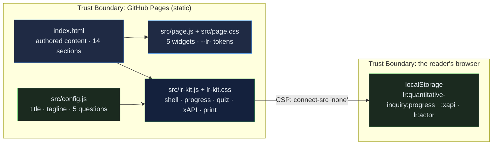

# Quantitative Inquiry in Education: a graduate-level guide from measurement to defensible inference, with a test selector, a significance-versus-effect-size explainer and a rigor self-check

[](https://github.com/Freddricklogan/quantitative-inquiry/actions/workflows/deploy.yml)
[](#5-getting-started--verification)
[](https://github.com/Freddricklogan/quantitative-inquiry/actions/workflows/codeql.yml)
[](LICENSE)
[](https://freddricklogan.github.io/quantitative-inquiry/)

## 1. Executive Summary & Business Impact

**Problem statement.** Graduate students and school-district analysts run the test their software suggests, read p < .05 as proof, average Likert ranks, and cannot say why a correlation between breakfast and test scores does not justify a breakfast programme. The statistics are taught; the judgement — which test, what a p-value licenses, where a false positive comes from — is not practised.

**Solution & value delivered.** A fourteen-section resource that moves from the deductive logic of quantitative inquiry through measurement levels, reliability and validity, sampling and design, causal criteria, descriptive and inferential statistics, regression, survey design and critical appraisal, with widgets that make the reader decide: a test selector from three questions, an explainer that grows a sample until a fixed small effect turns significant, a rigor scorer, and a spot-the-flaw quiz over real-sounding claims. The page is one of ten
resources built on the shared
[Learning Resource Kit](https://github.com/Freddricklogan/learning-resource-kit):
an Executive Shell with live counts, collapsible sections whose progress is
saved in the reader's browser, a five-question quiz written for this
resource that records xAPI 1.0.3 statements locally, and a print layout that
opens every section. Nothing leaves the page; the content-security policy
forbids network calls.

**[→ Read the full case study](docs/CASE_STUDY.md)**

| Outcome | How this repo delivers it |
| --- | --- |
| A resource, not a slide deck | 14 sections (18 minutes at 230 wpm) with an executive summary first: logic of inquiry, hypothesis testing, levels of measurement, reliability and validity, sampling and design, correlation and causation, descriptive vs inferential, regression, survey design, test selector, common tests, reading results critically, rigor, glossary |
| Interactive where it matters | 5 authored widgets (see §4) kept intact through the conversion and verified under a strict CSP |
| Evidence of learning | Quiz answers and completion recorded as xAPI statements with an anonymous actor; inspectable on the page |
| Reviewable by an institution | No inline script or style, typed buttons, table bodies, a `<main>` landmark; html-validate and ESLint in CI |
| Usable everywhere | Keyboard-operable sections, deep links that open their section, print stylesheet, no horizontal scroll at 400 px |

## 2. Demonstrated Competencies & Technical Skills

- **EdTech & Human-Centered Design** — judgement before formulas: the explainer lets the reader watch p shrink while Cohen's d stays at 0.20; the selector and spot-the-flaw quiz ask for a decision before the page explains; the critical-appraisal section names p-hacking, HARKing and optional stopping so students recognise them in the literature they read.
- **Systems Architecture & CS** — authored content in `index.html`, its
  widgets in `src/page.js`, its styles in `src/page.css` under the `--lr-`
  namespace; the kit vendored as `src/lr-kit.js`; config and tests that
  fail CI if a quiz question is malformed.
- **Cybersecurity & Compliance** — `default-src 'none'; script-src 'self';
  connect-src 'none'`; no third-party script; Trivy, npm audit and CodeQL in
  CI.
- **Data Science & AI** — reading time and section counts computed from the
  content at load; scores recorded as scaled results, never claimed.

## 3. System Architecture & Data Flow



## 4. Technical Highlights & Engineering Decisions

### The authored widgets

| Widget | What it does |
| --- | --- |
| Design tabs | Switch between research-design panels (experimental, quasi-experimental, correlational, descriptive) with each design's logic and the claim it can bear |
| Test selector | Three questions — goal, number of groups or predictors, outcome type — suggest a starting test with a rationale and a reminder to check assumptions |
| Significance vs effect size | A slider grows the per-group sample for a fixed d = 0.20; the approximate p-value and a Yes/No significance flag update while the effect size stays put |
| Rigor scorer | Weighted checklist of measurement and transparency practices; fills a bar and gives an Emerging / Developing / Strong verdict |
| Spot-the-flaw quiz | Claims from observational studies and reports; the reader names the flaw and sees the explanation |

### ADR-1 — Convert, do not rewrite

**Context.** The original was one hand-authored file: rich content and
bespoke widgets, but inline styles and scripts that no content-security
policy or validator accepts.

**Decision.** The kit's converter moved the stylesheet and scripts out of
the page, replaced 81 inline style attributes with
30 generated classes, namespaced 26 custom properties, typed
28 buttons, gave 8 tables a body and wrapped the content in a `<main>` landmark. The content and
widget code were not rewritten; `AUDIT.md` lists every change.

**Consequence.** The page passes html-validate under a strict CSP with its
original behaviour intact, and the change is auditable line by line.

### ADR-2 — One quiz, one attempt, standard statements

**Context.** The page's own self-checks vanish on reload and record nothing.

**Decision.** Five questions written from this resource's content live in
`src/config.js`; the kit accepts a single attempt per question, shows the
explanation, and records xAPI *answered* and *completed* statements with a
scaled score, kept in the browser and shown as JSON.

**Consequence.** The score reflects what the reader knew before the
explanation, and an institution can see the exact statements a learning
record store would receive.

### ADR-3 — Progress means opened

**Context.** Scroll depth is easy to measure and says little about reading.

**Decision.** A section counts as opened when its collapsed state is
removed — by click, keyboard, deep link or "Expand all" — and an
*experienced* statement is recorded once.

**Consequence.** The KPI strip is conservative: 14 sections, and the count
only rises when the reader opens one.

## 5. Getting Started & Verification

**Prerequisites.** Node 22 for the checks; the page itself needs only a
browser.

```bash
git clone https://github.com/Freddricklogan/quantitative-inquiry.git
cd quantitative-inquiry
npm ci
npm run check     # eslint → html-validate → vitest
npx serve .       # open http://localhost:3000
```

**Verification — the numbers this repository actually produced:**

```bash
npm run lint      # 0 problems
npm run validate  # html-validate index.html: clean
npm run coverage  # 7 passed; All files 79.84% (config.js 100%, vendored lr-kit.js 78.75%)
```

| Check | Result |
| --- | --- |
| Unit tests (Vitest, jsdom) | **7 passed / 7** across 2 files — quiz validity, page invariants, the kit mounted on this page |
| Coverage | All files **79.84%** statements: `src/config.js` 100%, vendored `src/lr-kit.js` 78.75% from this page's smoke test (the kit's own suite covers it at 99%) |
| ESLint, html-validate | clean |
| Conversion audit | 81 inline styles → 30 classes · 26 tokens namespaced · 28 buttons typed · 8 tables fixed |
| Headless Chrome smoke | **0 console errors**; all 5 widgets exercised; sections opened 14/14 on Expand all; no horizontal scroll at 1200 or 400 px |

## 6. Live Demo & Production Showcase

**<https://freddricklogan.github.io/quantitative-inquiry/>**

**30-second guided walkthrough.** Press **Take the 30-second tour**.

1. **A graduate-level resource, not a slide deck** — 14 sections, about
   18 minutes of reading.
2. **Open a section** — the first section opens and the count rises.
3. **Check your understanding** — five questions on hypothesis testing, measurement levels, reliability, confounding and questionable research practices.
4. **Your statements, inspectable** — the xAPI JSON recorded in this browser.

The quiz covers:
- what failing to reject the null licenses
- legitimate statistics for ordinal data
- reliability versus validity
- confounding and the causal criteria
- HARKing and pre-registration

Part of the resource hub at <https://freddricklogan.github.io/resources/>.
